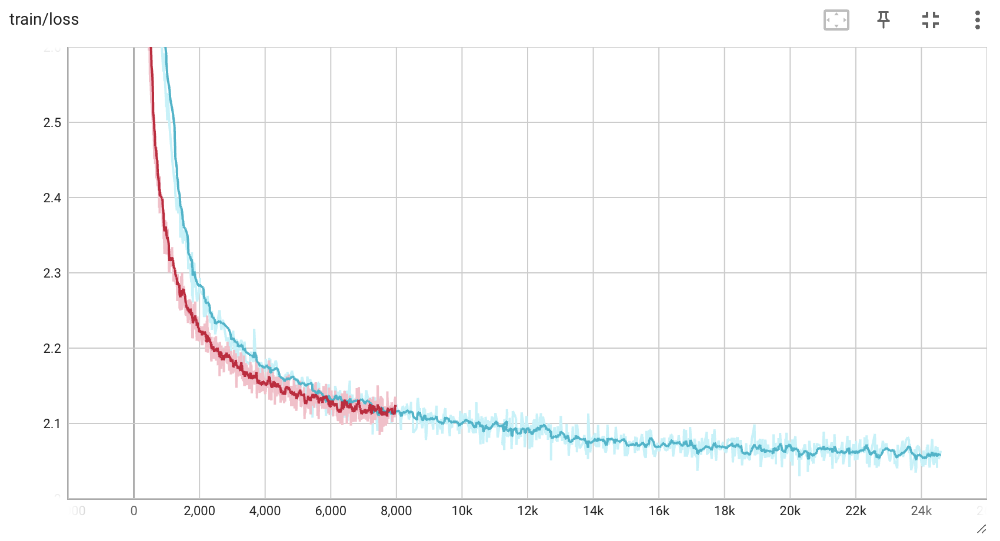

<p align="center">
    <br>
    
    <br>
</p>

We enhance our previous tokenizer in [vietnamese-llama2-4b-40GB](https://huggingface.co/bkai-foundation-models/vietnamese-llama2-7b-40GB) by training [SentencePiece](https://github.com/google/sentencepiece) a more extensive collection of clean Vietnamese documents spanning diverse domains such as news, book, stock, finance and laws. 
In contrast to the previous version, we follow the original LLaMA-2 paper to split all numbers into individual digits. Again, the updated tokenizer markedly enhances the encoding of Vietnamese text, cutting down the number of tokens by 50% compared to ChatGPT and approximately 70% compared to the original Llama2.

Here are our data sources:
- 53 GB  NewsCorpus (clean + dedup BinhVq's [NewsCorpus](https://github.com/binhvq/news-corpus) combined with our self-crawled data up to October 2023). Thanks [iambestfeed][https://huggingface.co/iambestfeed] for his great work in crawling news data.
- 1.3 GB Vietnamese Wikipedia (updated to October 2023)
- 8.5 GB [Vietnamese books](https://www.kaggle.com/datasets/iambestfeeder/10000-vietnamese-books)
- 4.8 GB Vietnamese legal documents (clean and dedup)
- 1.6 GB stock news (clean and dedup)
- 43 GB Vietnamese text (subsampled from Culturax-vi)
- 2.3 GB English Books (sub-sampled from [pg19](https://huggingface.co/datasets/pg19))
- 2.2 GB English Wikipedia

- 16 GB English text (subsampled from Culturax-en)

We then merge all data sources and perform the last deduplication, resulting in a final pretraining dataset of 124 GB, including 104 GB of Vietnamese text and 20 GB of English text.

We conduct a single-epoch continual pretraining using the Llama2-7B model.

We trained the model on a DGX A100 system, utilizing four GPU A100 in 40 days (about 4000 GPU hours). 

Hyperparameters are set as follows:
- Training Regime: BFloat16 mixed precision
- Lora Config: 
  
  ```
  {
    "base_model_name_or_path": "meta-llama/Llama-2-7b-chat-hf",
    "bias": "none",
    "enable_lora": null,
    "fan_in_fan_out": false,
    "inference_mode": true,
    "lora_alpha": 32.0,
    "lora_dropout": 0.05,
    "merge_weights": false,
    "modules_to_save": [
      "embed_tokens",
      "lm_head"
    ],
    "peft_type": "LORA",
    "r": 8,
    "target_modules": [
      "q_proj",
      "v_proj",
      "k_proj",
      "o_proj",
      "gate_proj",
      "down_proj",
      "up_proj"
    ],
    "task_type": "CAUSAL_LM"
  }
  
  ```

Please note that **this model requires further supervised fine-tuning (SFT)** to be used in practice!

Usage and other considerations: We refer to the [Llama 2](https://github.com/facebookresearch/llama)

Below are our full models on HuggingFace:

| Model Name            |       Type        |  Size   |                        Download Link                         |
| :-------------------- | :---------------: | :-----: | :----------------------------------------------------------: | 
| Vietnamese-LLaMA-2-7B-40GB | Base model | 12.9 GB | [🤗HF]([https://huggingface.co/hfl/chinese-llama-2-7b](https://huggingface.co/bkai-foundation-models/vietnamese-llama2-7b-40GB)) | 
| Vietnamese-LLaMA-2-7B-120GB | Base model | 12.9 GB | [🤗HF]([https://huggingface.co/hfl/chinese-llama-2-7b](https://huggingface.co/bkai-foundation-models/vietnamese-llama2-7b-120GB)) | 

**Training loss** (the red line indicates the learning curve of [vietnamese-llama2-4b-40GB](https://huggingface.co/bkai-foundation-models/vietnamese-llama2-7b-40GB)):



**Disclaimer**

This project is built upon Meta's Llama-2 model. It is essential to strictly adhere to the open-source license agreement of Llama-2 when using this model. If you incorporate third-party code, please ensure compliance with the relevant open-source license agreements.
It's important to note that the content generated by the model may be influenced by various factors, such as calculation methods, random elements, and potential inaccuracies in quantification. Consequently, this project does not offer any guarantees regarding the accuracy of the model's outputs, and it disclaims any responsibility for consequences resulting from the use of the model's resources and its output.
For those employing the models from this project for commercial purposes, developers must adhere to local laws and regulations to ensure the compliance of the model's output content. This project is not accountable for any products or services derived from such usage.

**Acknowledgments**

We extend our gratitude to PHPC - Phenikaa University and NVIDIA for their generous provision of computing resources for model training. Our appreciation also goes out to [binhvq](https://github.com/binhvq/news-corpus), [iambestfeed](https://huggingface.co/iambestfeed) and the other authors for their diligent efforts in collecting and preparing the Vietnamese text corpus.
