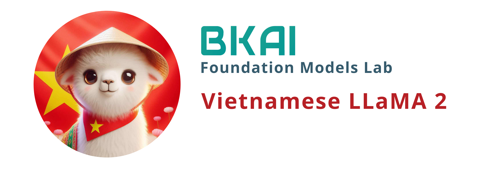

<p align="center">
    <br>
    
    <br>
</p>


---
license: other
datasets:
- vietgpt/wikipedia_vi
- wikipedia
- pg19
- mc4
language:
- vi
- en
---

We employed [SentencePiece](https://github.com/google/sentencepiece) to retrain a Vietnamese tokenizer with a vocabulary size of 20K. No Vietnamese word segmentation was used. We then merged this vocabulary with the original one of Llama2, removing duplicate tokens.
The new tokenizer significantly improves when encoding Vietnamese text, reducing the number of tokens by 50% compared to ChatGPT and approximately 70% compared to the original Llama2.

We conducted a single-epoch continual pretraining, also known as incremental pretraining, using the Llama2-chat 7B model on a mixed dataset totaling 40.5 GB, comprised of:
- 19 GB [NewsCorpus](https://github.com/binhvq/news-corpus)
- 1.1 GB Vietnamese Wikipedia
- 1.6 GB [Vietnamese books](https://www.kaggle.com/datasets/iambestfeeder/10000-vietnamese-books)
- 4.5 GB Vietnamese legal documents (crawled from thuvienphapluat and processed by ourselves)
- 2.1 GB Vietnamese legal text (from [C4-vi](https://huggingface.co/datasets/c4))
- 1.1 GB English Books (sub-sampled from [pg19](https://huggingface.co/datasets/pg19))
- 1.1 GB English Wikipedia (sub-sampled from 20220301.en wikipedia)
- 10 GB English Text (sub-sampled from [C4-en](https://huggingface.co/datasets/c4))

We trained the model on a DGX A100 system, utilizing four GPU A100 in 10 days (about 1000 GPU hours). 

Hyperparameters are set as follows:
- Training Regime: BFloat16 mixed precision
- Lora Config: 
  
  ```
  {
    "base_model_name_or_path": "meta-llama/Llama-2-7b-chat-hf",
    "bias": "none",
    "enable_lora": null,
    "fan_in_fan_out": false,
    "inference_mode": true,
    "lora_alpha": 32.0,
    "lora_dropout": 0.05,
    "merge_weights": false,
    "modules_to_save": [
      "embed_tokens",
      "lm_head"
    ],
    "peft_type": "LORA",
    "r": 8,
    "target_modules": [
      "q_proj",
      "v_proj",
      "k_proj",
      "o_proj",
      "gate_proj",
      "down_proj",
      "up_proj"
    ],
    "task_type": "CAUSAL_LM"
  }
  
  ```

We also provide the [LoRA part](https://huggingface.co/bkai-foundation-models/vietnamese-llama2-7b-40GB/tree/main/pt_lora_model) so that you can integrate it with the original Llama2-chat-7b by yourself.

Please note that **this model requires further supervised fine-tuning (SFT)** to be used in practice!

Usage and other considerations: We refer to the [Llama 2](https://github.com/facebookresearch/llama)

Training loss:


**Disclaimer**

This project is built upon Meta's Llama-2 model. It is essential to strictly adhere to the open-source license agreement of Llama-2 when using this model. If you incorporate third-party code, please ensure compliance with the relevant open-source license agreements.
It's important to note that the content generated by the model may be influenced by various factors, such as calculation methods, random elements, and potential inaccuracies in quantification. Consequently, this project does not offer any guarantees regarding the accuracy of the model's outputs, and it disclaims any responsibility for consequences resulting from the use of the model's resources and its output.
For those employing the models from this project for commercial purposes, developers must adhere to local laws and regulations to ensure the compliance of the model's output content. This project is not accountable for any products or services derived from such usage.

**Acknowledgments**

We extend our gratitude to PHPC - Phenikaa University and NVIDIA for their generous provision of computing resources for model training. Our appreciation also goes out to binhvq and the other authors for their diligent efforts in collecting and preparing the Vietnamese text corpus.
